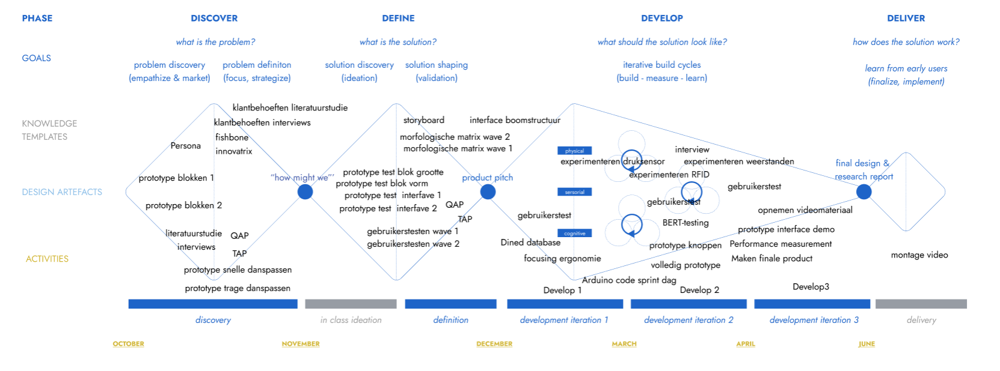
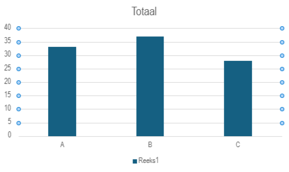

**MuziSym**

Het interactieve spel dat cognitieve, sensorische en motorische elementen combineert op een muzikale, toegankelijke en gebruiksvriendelijke manier. Dit zonder begeleider en op een zelfstandige manier

Projectteam: Thoma Demets en Cieters Jeroen

2024-2025

## Samenvatting
### Theoretisch
RGM: een interactieve en multisensorische oefenmethode die motorische, sensorische en cognitieve elementen bevat. Daarbij omvat:

- Het sensorische gedeelte: het waarnemen van de muziek en symbolen
- Het motorische gedeelte: het uitvoeren van de danspassen zoals in de rechterkolom
- Het cognitieve gedeelte: interpreteren van de symbolen en kleuren, deze linken aan de bijhorende danspas en deze juist coördineren.

Hierbij wordt er gebruik gemaakt van **symbolen en muziek**. Op deze muziek en symbolen worden danspassen uitgevoerd. Het combineren van deze elementen stimuleren de hersenen. 
Daarbij worden **dezelfde hersengebieden als bij het leren van een muziekinstrument geprikkeld**. “RGM therefore has the potential to activate the same brain areas as when learning how to play an instrument, although no instruments are involved.”[1].
Concreet resulteert deze methode in een hogere denksnelheid, kortere reactietijd, een betere coordinatie.[2] De theoretische werking wordt verder besproken in de inleiding.

### Spelverloop
Het initiële doel van dit spel is om de vier cilinders in de juiste volgorde te ordenen. Elk van deze cilinders wordt bij aanvang random gekoppeld aan een deel (1/4de) van het gekozen muzieknummer. Bij het vastnemen van 1 cilinder begint het gekoppelde deel van de muziek te spelen en verschijnen op het schermpje de bijhorende danspassen. De mogelijke combinaties zijn in onderstaande figuur weergegeven. Nadat dit deeltje is afgespeeld, wordt een tweede cilinder vastgenomen. Het hierbij horende muziekje en danspasjes worden afgespeeld. Vanaf nu kan gekozen worden deze van plaats te verwisselen of nog een derde vast te nemen. Het spel gaat zo verder totdat de blokken in de juiste volgorde staan.

## Introductie
### Theoretisch
Vooraleer het uitgebreider te hebben over het probleem is het eerst noodzakelijk dieper in te gaan op de theoretische werking van deze methode. Dit is noodzakelijk als achtergrond en aangezien het vervolg van dit proces steunt op dit principe.

Zoals eerder vermeld is dit een multi-sensorische denkoefening die gebruik maakt van zowel sensorische, motorische als cognitieve elementen bevat. **Het is net die combinatie van deze elementen die ervoor zorgt dat verschillende hersengebieden tegelijkertijd werken en geactiveerd worden. Het prikkelen van deze gebieden stimuleert deze hersengebieden en de verbindingen daartussen.** Daarbij is vooral het **belang van muziek niet te onderschatten.** Zo volgde uit een wetenschappelijk artikel: “In addition, musical activities induce grey and white matter changes in multiple brain regions, especially in front temporal areas”. Music also activates the dopaminergic mesolimbic system of the brain, which regulates memory, attention, executive function, mood, and motivation”[1]. Hierbij is het de bedoeling de het verkleinen van de cognitieve reserve tegen te gaan zoals uitgebreider besproken wordt in dit artikel van vrt-nws[3]

### probleem
**Alhoewel deze methode wetenschappelijk is aangetoond, staat deze methode praktisch echter nog in haar kinderschoenen.** In rusthuizen wordt slechts gebruikgemaakt van een beeldscherm [4] en [5], mensen en dan vooral ouderen thuis vallen helemaal uit de boot aangezien er in die methode een ebgeleider nodig is.

Het is deze grote “gap” die wij voor “65+ers zonder neurologische aandoening” op een gebruik(er)sgerichte en methodoligsche manier trachten op te lossen. Daarbij willen we de uitvoering van deze methode in een nieuw jasje steken zonder veel aan de theoretische werking te sleutelen.
### How might we
Hieruit volgt onze challenge, onze how might we:
**Hoe kunnen we 65 + ers zonder een neurologische aandoening preventief helpen bij het tegengaan van mentale veroudering door op een interactieve manier muziek, beweging, denken en waarnemen te integreren?**
### Stakeholders
De belangrijkste stakeholders in dit project zijn de testpersonen die de ook de eindgebruikers zijn. Wij danken hun zeer voor hun waardevolle imput.
De medestudenten in de Krook voor hun andere blik en feeddback op dit ontwerpproces
## Methodologie
Om een ontwerpproces tot een goed eind te brengen is het belangrijk methodologisch te werk te gaan en een goeie methodologie te gebruiken. Centraal in dit project wordtgebruik gemaakt van Zendesk tripple diamond zoals in onderstaande figuur. Daarnaast wordt vanuit de pyramide van Aaron Walter vertrokken. Daarbij wordt onderaan gestart om op uiteindelijk bij pleasurable uit te komen

 
### Discovery fase
Binnen deze tripple diamond is de discoveryfase de eerste fase. Zoals de naam het zelf zegt is het hierbij de bedoeling een goed en volledig beeld te krijgen inzake de RGM methode. 
Daarbij is het belangrijkste doel om vragen als: **Waar liggen de Gaps? Hoe werkt deze methode? Wie is de geschikte doelgroep?** Te beantwoorden
Daarbij vormt de **combinatie van een literatuurstudie en interviews een goede basis**. 

### Defenition fase

Binnen de defenition werd binnen de overkoepelende Zendesk tripple diamond methodologie onze eigen methode gebruikt:

Eerst werd een storyboard opgesteld die elke stap van het gebruiksproces benaderd. Hieruit werden mogelijke onderzoeksvragen opgesteld. Een deel van deze vragen kon al met de voorkennis van de literatuurstudie in interviews beantwoord worden. De overgebleven onderzoeksvragen onderzochten we in de gebruikerstesten. 

In deze fase wordt nudat de fundamentele kennis er is gekeken naar de functionele parameters van het concept. Vragen als **hoeveel blokken? Welke vorm hebben de blokken? En hoe snel volgen de danspassen op elkaar?** worden beantwoord.

 Hierbinnen werd gebruik gebruik gemaakt van 2 waves:

In de eerste wave staat functionaliteit centraal. Dit is van primair belang zoals ook uit Aaron Walters pyramid blijkt. Het doel is om vragen als **hoeveel blokken? En hoe snel volgen de danspassen op elkaar?** Te beantwoorden. Uiteindelijk kunnen nieuwe klantbehoeften worden opgesteld.

In de tweede wave staat meer de detaillering en het "pleasurable" centraal. Daarbij wordt meer naar de belonigssytemen en schermgrootte gekeken.

### Develop fase
Hierbij ligt de nadruk meer op detaillering en validereing van prototypes.
In develop 1 wordt nog gefocust op de ergonomie. 
In develop 2 wordt nog even teruggekomen op de ergonomie. Voornamelijk wordt hierbij op de integratie van de elektronica gefocust. Hieronder vallen zowel het mechanisme van de verbinding van de cilinder met het dockingstation als het type en grootte van de knop.
In develop 3 staat 
### Deliver fase 
Belangrijk: deze fase is overlappend en niet chronologisch

Uit voorgaande prototypes, gebruikerstesten, templates, experimenten (zie o.a. prototyping - elektronica) wordt een finaal prototype/product uitgewerkt. Met behulp van DaVinci Resolve en beeldmateriaal uit voorgaande testen wordt ook een video gerealiseerd. Deze geeft het ontwerpproces en het product weer.

## Discovery

#### Doestellingen
- Formuleren van een duidelijke "How might we"-vraag om richting te geven aan het ontwerpproces
- Opstellen klantbehoeften
- Algemeen beeld inzake RGM en beantwoorden onderzoeksvragen
#### Onderzoeksvragen  
literatuurstudie
- Wat is de RGM methode?
- Onderzoeksvragen secundair:  
- Hoe helpt de RGM methode mensen? 
- Hoe werkt deze methode? 
- voor wie is deze methode het meest geschikt? 
- is de doelgroep groot? 
- Welke rol speelt muziek?  
- Hoe werkt dit in de hersenen? Welke hersengebied bevindt zich waar? 
- Hoe veroudert ons lichaam? 

interviews
- Hoe staan 65+ ers zonder neurologische aandoening tegenover de RGM-methode?
- Welke aspecten van deze methode spreken hen aan? 
- Wat zien ze liever anders?  
#### Materiaal & methoden
* Literatuurstudie 
* Interviews 
* Benchmarking

### Resultaten literatuurstudie (N=10)
- [protocol](https://github.com/Thoma-D/UCD/blob/main/Bijlages/Discovery/protocol%20literatuurstudie.pdf)
- [rapport](https://github.com/Thoma-D/UCD/blob/main/Bijlages/Discovery/literatuurstudie%20gebruiksgericht.pdf)

Om een goed beeld te vatten van de RGM-methode en alle opportuniteiten er rond, wordt begonnen met een literatuurstudie. Hierbij werden zowel wetenschappelijke artikels, websites, databases en gewone artikels bestudeerd om met een solide basis te beginnen.

De belangrijkste bevindingen - die onder andere de onderzoeksvragen beantwoorden - worden hieronder weergegeven:

1. Als doelgroep wordt “65+ers zonder neurologische aandoening” gekozen. Geen kinderen omdat deze methode minder efficiënt en invloed heeft op hun hersenen. 65+ers omdat dit een groot deel van de bevolking is. Zo blijkt uit Statbel dat **18,9% van de Vlamingen 65+er** is.

2. De hedendaagse methode vereist een scherm, practionner en een groepsgebeuren zoals hieronder te zien. **Een belangrijke gap is dat er dus geen kant en klare thuis oplossing bestaat dat de eindgebruiker autonoom kan gebruiken.**

3. **Door de sterke achterliggende theorie van RGM zoals hierboven vermeld is het nuttig de theoretische werking( combinatie muziek, symbolen en danspassen) over te nemen en in een nieuw jasje te steken. Het is de bedoeling de theoretische werking te integreren in een eindproduct.**

4. In dit [1] wetenschappelijk artikel wordt de methode theoretisch samengevat: “In addition, musical activities induce grey and white matter changes in multiple brain regions, especially in front temporal areas [3]. Music also activates the dopaminergic mesolimbic system of the brain, which regulates memory, attention, executive function, mood, and motivation.” Wat verder wordt gezegd: “RGM therefore has the potential to activate the same brain areas as when learning how to play an instrument, although no instruments are involved.” **Muziek speelt dus een heel belangrijke rol.**

5. Uit dit [6] wetenschappelijk artikel volgt dat de mens verouderd doordat dit in ons DNA zit en door chemische reacties versterkt door UV straling. In functie van deze oorzaken kan binnen onze haalbaarheid niet worden ontworpen. wel kunnen bovenstaande voordelen blijven wanneer de theoretische werking van RGM verder geintegreerd wordt tot een product.
Hieruit volgt onderstaand fishbone diagram.

 
 

> [IMPORTANT]
> Design Requirements:
> - D1.1 Het product moet meerdere hersengebieden activeren	
> - D1.2 Het product moet in groep te kunnen gebruiken zijn	
> - D1.3 Het product moet fouten maken toelaten
> - D1.4 Het product moet muziek bevatten	
> - D1.5 Het product moet ritme bevatten	
> - D1.6 Het product moet de ervaring geven/ er in slagen dat de doelgroep er steeds beter in wordt

### Interviews (N=4)
- [protocol](https://github.com/Thoma-D/UCD/blob/main/Bijlages/Discovery/protocol%20interview.pdf)
- [rapport](https://github.com/Thoma-D/UCD/blob/main/Bijlages/Discovery/interview%20verslag.pdf)

Het is ook belangrijk rechtstreekse input van de gebruiker te krijgen en deze beter te leren kennen dan deze zichzelf kent. Door middel van interviews kan op deze manier direct bekeken worden wat de gebruiker zelf vindt. **Zo kan in een wetenschappelijk artikel staan dat muziek positieve effecten heeft, maar dat de gebruiker hier niet voor muziek open staat.** Om dit te vermijden werden vier proefpersonen die binnen de doelgroep “65+ers zonder neurologische aandoening” vallen geïnterviewd.

Wanneer ze gevraagd worden naar de originele methode te kijken, blijkt dat: 

1. **“Het ziet er zo moeilijk uit al deze dingen tegelijkertijd te doen”.** Hiermee geeft Marleen Hofman aan dat ze de combinatie van motorische, sensorische en cognitieve prikkels te veel vindt." 
De danspassen die in de rest van dit project noodzakelijk zijn zullen dus trager op elkaar aansluiten.

2. **“Ik hoop hiermee mijn grenzen te verleggen. Achteraf hoop ik te kunnen zeggen: amai ik had nooit gedacht dat ik dit zou kunnen”.** Hiermee geeft Joske aan wat ze met dit spel zou willen bereiken. Daaruit blijkt dat de gebruiker open staat voor het concept.

3. Als naar hun gevoelens op de **gevoelsroos van Plutchik** gevraagd wordt komen vooral de gevoelens: angst en nieuwsgierigheid op.

4. Na het afnemen van de interviews kan bovenstaande informatie samengevat worden in onderstaande persona. Dit is belangrijk in het vervolg van het proces zodat telkens gebruiksgericht ontworpen wordt.

> [!IMPORTANT]
> Design Requirements:
> - D1.7 Het product moet verschillende moeilijkheid niveaus bevatten	
> - D1.8 Een sessie moet geleidelijk opbouwen	
> - D1.9 De muziek moet instelbaar of gekend zijn	
> - D1.10 Het product moet thuis te gebruiken zijn	
> - D1.11 Het product moet voor zowel individuele (eenzame) als meerdere personen tegelijkertijd geschikt zijn 	
> - D1.12 Het product moet een alternatief voor dans kunnen bevatten	
> - D1.13 Het product moet buiten te gebruiken kunnen zijn 	
> - D1.14 Het product moet zo weinig mogelijk schermen, verbinding met smartphones en tablets bevatten	

### Benchmarking (N=11)
- [protocol](https://github.com/Thoma-D/UCD/blob/main/Bijlages/Discovery/ProtocoL_Benchmarking_Thoma_Demets.pdf)
- [rapport](https://github.com/Thoma-D/UCD/blob/main/Bijlages/Discovery/Studie_Benchmarking_Thoma_Demets.pdf)

Aan de hand van Benchmarking werd de huidige markt en hun huidige oplossingen geanalyseerd. Deze worden in onderstaande tabel op basis van een analyse, specificaties... weergegeven.

Momenteel passen geen producten RGM rechtstreeks toe. Daarom werden hierbij gelijkaardige, relevante en succesvolle producten geanalyseerd om zo tot extra design requirements te komen. Uiteindelijk werd met deze data volgende tabel opgesteld. 

### Conclusies & implicaties
De analyse vanuit literatuurstudie, interviews en benchmarking heeft geleid tot een duidelijk beeld van de doelgroep, “65+’ers zonder neurologische aandoening,” en hun behoeften. De doelgroep staat open voor de RGM-methode, maar vraagt om een rustiger tempo, meer herhaling en verschillende moeilijkheidsniveaus. Daarnaast is er een sterke voorkeur voor een gebruiksvriendelijke thuisoplossing die zelfstandig kan worden gebruikt. Benchmarking toont aan dat er momenteel geen directe RGM-producten op de markt zijn, maar vergelijkbare oplossingen bieden waardevolle inzichten voor het ontwerp en bevestigen de bestaande marktkans. In onderstaande innovatrix kan bovenstaande informatie nog een samengevat worden.

Uiteindelijk volgt de how might we:

**Hoe kunnen we 65 + ers zonder een neurologische aandoening preventief helpen bij het tegengaan van mentale veroudering door op een interactieve manier muziek, beweging, denken en waarnemen te integreren?**

## Definition

### WAVE 1 (N=5)
- [protocol](https://github.com/Thoma-D/UCD/blob/main/Bijlages/Definition/protocol%20gebruikerstest%20wave%201.pdf)
- [rapport](https://github.com/Thoma-D/UCD/blob/main/Bijlages/Definition/gebruikerstest%20wave%20one.pdf)

**Om comformation bias te vermijden en ervoor te zorgen dat de gebruiker nuttige feedback kan geven, werd telkens van meerdere prototypes gebruik gemaakt**. Hierdoor zijn er op de afbeeldingen van prototypes meestal twee varianten te zien.

Tijdens de 1ste wave werd er eerst gedaan aan “concept testing” waarbij de interesse in het concept wordt getest. Hierbij werd methodisch gewerkt, we zijn vertrokken vanuit een storyboard, daaruit hebben we de belangrijkste onderzoeksvragen afgeleid, en deze in een morfologische matrix gegoten waarna we voor elk van de problemen antwoorden zochten. Vervolgens konden we aan de hand van de vooraf afgelegde research een eerste eliminatie doen van mogelijke antwoorden. Uiteindelijk werden de overgebleven onderzoeksvragen verder onderzocht: 

#### Doestellingen
- Bepalen hoe de danspassen weergeven worden
- Bepalen als de blokken te onderscheiden moeten zijn
- Bepalen van het aantal blokken
#### onderzoeksvragen
- Hoeveel blokken worden gebruikt?
- welke vorm hebben de blokken?
- Hoe snel volgen de danspassen elkaar op
- Hoe worden de danspassen weergegeven
#### Materiaal & methoden
- Smartphone
- Video's RGM danspassen
- 6 indentiek gekleurde blokken
- 4 verschillend gekleurde blokken
- TAP (think out lout protocol)
- QAP (Question asking protocol)
- Intervieuw

  
  

### Resultaten

**Hoe worden danspasjes weergegeven?** 

Voor de eerste wave werden vooraf 3 variaties van videofragmenten van “Laat de zon in je hart” met RGM-symbolen voorbereid. Waarbij een verandering van danspas werd weergegeven aan de hand van een korte overgansanimatie. 

 

* 1: Frequentie danspassen: om de 4 slagen

  Lied verdeeld in: 4
  [Links naar video's](https://github.com/Thoma-D/UCD/blob/main/Bijlages/Definition/Videofragmenten/Traag%204/Trage%20video's)

* 2: Frequentie danspassen: om de 2 slagen

  Lied verdeeld in: 4
  [Links naar video's](https://github.com/Thoma-D/UCD/blob/main/Bijlages/Definition/Videofragmenten/snel%204/snelle%20video's%20(in%204))

* 3: Frequentie danspassen: om de 2 slagen

   Lied verdeeld in: 6
  [Links naar video's](https://github.com/Thoma-D/UCD/blob/main/Bijlages/Definition/Videofragmenten/snel%206/snelle%20video's%20(in%206))

60% van de gebruikers verkoos de trage versie. Aangezien deze cijfers verdeeld zijn, is het het best hen de keuze te geven. 

**Hoe kan je de blokjes onderscheiden? Is dit nodig?**

Hiervoor werden voor het 1ste spel 4 blokken met dezelfde kleuren voorzien, en voor het 2de 4 met verschillende kleuren.

  
  

Uit observatie en een achteraf afgelegde ondervraging, konden we concluderen dat 60% verkoos ze te kunnen onderscheiden. 

 
 

Om de keuze aan de gebruiker te geven zal 1 van de zijdes verschillend bij elke blok worden ingekleurd (rood, blauw,...), en de andere zijde bij elke blok dezelfde (zwart). Uiteindelijk werd hieruit ook bepaald om de vorm van de blokken cilindrisch te maken om zo 2 functionele zijdes te creeren. Dit leide dan tot design requirements D2.3 en D2.2.
 

**Hoeveel blokjes worden er gebruikt (fixed?)**

 Het spel werd 3x gespeeld, startent bij de makkelijkste variant.
 
 Hierbij zagen we dat het al een grote uitdaging was met 4 blokken om deze in de correcte volgorde te plaatsen.

> “Het is lastig om zowel op de danspassen als de muziek te letten” 

Na afloop verkoos 80% de variant met 4 blokken. Hieruit volgt de design requirement D.1.

 
 
 

 **TAP/QAP**
 
 Wat opviel is dat de grootste moeilijk lag bij het sorteren van de blokken. 60% van de gebruikers vroeg, of vermelde dat ze graag het de mogelijkheid zouden hebben een nummer op voorhand eens te beluisteren. Vandaar design requirment D1.15

> “Welke kant is rood”

Bij de kleuren en hun bijhorende kanten werden ook veel fouten gemaakt, daaruit volgt design requirment D 4.4
 
 ### Conclusies
**spel**

Het product laat de gebruiker het liedje op voorhand horen als dit gewenst is.

**interactieve blokken**

Het product bezit 4 interactieve cilindervormige blokken met 2 fuctionele zijdes.

**Docking station**

Er zit 1 centrale speaker in de docking station, zo houden we de kostprijs lager en kunnen we de cilinders compacter houden.
De dockingstation geeft aan welke kant rood en blauw moeten voorstellen.
 
> [!IMPORTANT]
> Design Requirements:
> - D1.15 Het product moet de mogelijkheid geven het muzieknummer vooraf volledig te spelen
> - D2.1 Het product moet vier interactieve blokken bevatten	* Het product moet verschillende moeilijkheidsgraden hebben
> - D4.4 Het product moet duidelijk aangeven wat rechts(rood) en wat links(blauw) is
> - D2.3 De interactieve blokken zijn cilindervormig, om duidelijk 2 verschillende kanten te hebben, met elk zijn unieke functie
> - D2.2 	De interactieve blokken moeten zowel een te onderscheiden als een niet te onderscheiden kant hebben (1kant allemaal dezelfde kleur, 1 kant allemaal een verschillend kleur)
> - D4.3 De docking station van het product moet een speaker bevatten	

## WAVE 2 (N=5)
 [protocol](https://github.com/Thoma-D/UCD/blob/main/Bijlages/Definition/protocol%20interview%20wave%202.pdf)
[rapport](https://github.com/Thoma-D/UCD/blob/main/Bijlages/Definition/gebruikerstest%20wave%20two.pdf)

Nadat de inhoudelijke werking vastligt en dit gevalideerd is door de gebruiker wordt in de tweede wave werd voornamelijk meer op de details gefocust. Hieronder vallen geometrie, kleur en interface. Ook in deze wave werd methodisch te werk gegaan en vanuit een morfologische matrix gewerkt. Hieruit konden nieuwe onderzoeksvragen worden opgesteld. Voor elk van deze vragen werden verschillende oplossingen gezocht. Een deel van deze onderzoeksvragen kon met de voorgaande kennis van de discovery fase beantwoord worden. De overgebleven onderzoeksvragen worden in deze gebruikerstesten onderzocht.

### Doestellingen
- Bepalen kleur
- Bepalen geometrie en displaygrootte
- Bepalen interface
- Hoe staan ouderen t.o.v. belonigsystemen
  
### Materiaal & methoden
- Figma interface met woorden en interface met symbolen
- Smartphone (6.7")
- Tablet (10.9")
- Laptop (15.6")
- tv

  
- Interview
- BERT-test

De gebruikerstesten worden uitgevoerd als een combinatie van BERT-testen en interviews. **De BERT-testen zorgen voor kwantitatieve informatie. De interviews voor meer kwalitatieve info.**
  
### Resultaten

**Welke displaygrootte moet het product hebben?**

Daarvoor werden tijdens de interviews gebruik gemaakt van een smartphone, tablet, een laptop en een TV. Zoals op onderstaande figuur te zien is.  

 
 

Hierop reageerden de gebruikers verdeeld. 40% koos voor het 6.7" scherm, 40% tv en 20% 10.9" scherm zoals in onderstaande grafiek te zien is. Daarbij valt op dat de trendlijn daalt en links het hoogst ligt aangezien daar de meeste waarden liggen.

 
 

Wat ook op viel is dat Aangezien de doelgroep niet weet wat een HDMI- kabel is kan dit ook niet gekoppeld worden aan een tv-scherm. **Zie interview Willy: “wat is een HDMI-kabel”.**  

**Welke afmetingen hebben de cilinders**

Uit wave 1 was gebleken dat deze cilindervormig moeten zijn. A.d.h.v. drie groottes kan de gebruiker nu nauwkeuriger kiezen welke deze het meest aangenaams vindt. Uit de BERT testen en interviews blijkt dat 80% 45mm als diameter verkiest. Dit doordat deze het makkelijkst vast te pakken zijn.

 
 

**Kent de doelgroep beloningssystemen en staan ze hiervoor open?**

Ook binnen onze doelgroep worden de geïnterviewden wel degelijk geconfronteerd met dergelijke systemen. Vooral klantenkaarten en klantenapps bij supermarkten blijken populair te zijn. Daarbij viel op dat hun voorkeur uitgaat naar een manuele kaart i.p.v. een app waar ze veel meer met dergelijke systemen geconfronteerd worden. Uiteindelijk blijkt dat ze openstaan om hun vooruitgang te zien maar minder geïnteresseerd zijn in echte grote beloningssystemen. 

**Waar moet aandacht aan worden besteed om tot een goede interface te komen?**

Voor deze laatste onderzoeksvraag werden twee verschillende interfaces a.d.h.v. figma gemaakt. één met woorden en één met symbolen. Deze zijn terug te vinden bij de bijlagen. De bedoeling was om de gebruiker hierdoor te zien navigeren en te zien of deze erin slaagt een sessie te starten. Eenvoud stond hier centraal. Deze aanpak bleek ook te werken. Hoe simpeler de interface bleek, hoe minder verwarring en vlotter de gebruiker hierdoor kon navigeren. Wat wel opviel is dat de doelgroep veel minder vertrouwt blijk te zijn met symbolen dan gewoon woorden. Bijgevolg zal worden verder gewerkt met een interface a.d.h.v. symbolen
Om de uitwerking van de interface in het vervolg van het proces vlotter te laten verlopen werd een boomdiagram van de interface gemaakt zoals in onderstaande figuur te zien is.

 

 
**Kleur**

Kleur werd uiteindelijk al in de verwerking van wave 1 bepaald.

### Conclusies
**Displaygrootte**

Naast het feit dat de cijfers verdeeld waren wordt voor een scherm tussen 6.7" en 10.9" gekozen. Dit om de kostprijs te drukken, om het sukkelen met HDMI poorten te vermijden (zie interview Willy: “wat is een HDMI-kabel”) en aangezien volgens de trendlijn daar de meeste waarden liggen.

**Cilindergrootte**

De cilinder heeft een diameter van 45 mm.

**Beloningsysteen**

Doelgroep wenst geen uitgebreid beloningssysteem.

**Interface**

De interface moet voldoende simpel zijn.
De interface steunt voornamelijk op woorden en niet op symbolen.

> [!IMPORTANT]
> Design Requirements:
> - D3.3 De schermgrootte ligt tussen 6.7" en 10.9"
> - D2.4 De interactieve blokken hebben een hoogte en straal van 45mm
> - D1.17 De gebruiker heeft de mogelijkheid om zijn vooruitgang te zien
> - D3.1 en D3.2 De interface moet simpel zijn. Daarbij wordt voornamelijk van woorden gebruik gemaakt

## Develop 1: Ergonomie deel 1
### Doestellingen
1. Bepalen van de meest ergonomische massa.
 1a. a.d.h.v. gebruikerstest voor rechtstreekse input.

2. ergonomische afmetingen
- 2a. Omtrek a.d.h.v. database gebruikt voor een grotere steekproef (werd eerder uit gebruikerstest bepaald)
- 2b. Hoogte 

### Materiaal & methoden
- Ondoorzichtige cilinder (2X) 
- Anders niet tegelijkertijd 
- Weegschaal 
- Vloeistof( water) 

- Percentile driven design 
- Gebruikerstest  

- Dined database 

### Resultaten
**1a: Meest ergonomisch gewicht**

Er werden 2 gewichten met een verschil van 100g aan de gebruiker voorgeschoteld, om deze door hen te laten vergelijken. 
Hieruit kiezen ze hun voorkeur, vervolgens wordt vanaf deze massa, met een kleiner verschil (50g, 25g) deze stap herhaald. Dit tot hun ideale massa is bepaald.

 

Uit deze test werden onderstaande waarden verkregen

Binnen dit percentile driven protocol willen we een zo aangenaam mogelijk gewicht verkrijgen. Hierdoor wordt de strategie design for the mean toegepast zoals in onderstaande figuur te zien is. Belangrijk is dat het gaat om het voorkeursgewicht en niet maximale. Na verwerking in excel volgt hieruit dat het gemiddelde gewicht 230,8g is.

**2a: Omtrek cilinder (database)**

Uit gebruikerstesten blijkt dat de gebruiker de cilinder op twee verschillende manieren vastneemt. 1 Daarvan is met de volledige hand. Om dit te onderzoeken werden in de Dined database onderstaande parameters ingesteld. Hierbij zijn de grote waarden interessant. Aan gezien een maximaal contactopp belangrijk is. Dus de omtrek is 129mm + 3*13=155mm. Hieruit volgt ideale diameter = 49,34mm. Belangrijk om te vermelden: deze gegevens zijn van leeftijden van 20-30j aangezien de leeftijden van 60+ers niet bekend is.

 

.

**2b: hoogte cilinder (database)**

De database werd ingesteld zoals hierboven weergegeven. Aangezien hier de grootste handen de cilinder ook moeten kunnen vastnemen wordt weer design for the tall gebruikt. waarde = mean + 3 sd = 85+3*6=103mm

### Conclusies
**1a: Meest ergonomisch gewicht**

De cilinders hebben elk een gewicht van 230,8g. 

**2a: Omtrek cilinder (database)**

Wanneer de waarden van de omtrek van de cilinders uit de database en de gebruikerstest vergeleken worden valt op dat deze vrij dicht bij elkaar liggen. Respectievelijk 49,34 mm en 45mm. Aangezien de gebruikers zelf voorhang hebben op databases wordt verder gerekend met 45mm

**2b: hoogte cilinder (database)**

De hoogte van de cilinder bedraagt 103mm.

> [!IMPORTANT]
> Design Requirements:
> - D2.6 De cilinder weegt 230,8g
> - D2.5 De hoogte bedraagt 103mm

## Develop 2 (N=4)
### Doestellingen
- Uitesten van spel
- Bepalen van beste extra grip
- Bepalen begrip contact LED's
- Bepalen beste knop voor einde v.h. spel
### Materiaal & methoden
- Knoppen
- extra scherm(protopie)
- Prototype docking station+ arduino/ bekabeling
- Cilinders (+weerstanden) 
-TAP & QAP
- Bipolar emotional response testing (BERT)
- comparative usability testing 
### Resultaten

**Welke cilinder-grip wordt verkozen, waarom?**

 

Hiervoor werden 3 cilinder toppers met elkaar vergeleken in spel context en achteraf geevalueerd op meerdere categorieen met een comparative usability testing.

 

Uit deze test blijkt dat deze grip B door de meeste gebruikers gekozen wordt. Vervolgens grip A en als laatste C. 

Hieruit volgt design requirment D2.7. 

**Hoe wordt gecommuniceerd dat de cilinders zeker een goed contact hebben?**

1. **Vorm cutout**

Om te zorgen dat de elektronische elementen correct worden gealinieerd worden inzinkingen voorzien waarin de cilinders inpassen. Deze affordance maakt ook duidelijk waar de cilinders moeten worden geplaatst op de docking station.

Tijdens de observatities werd vastgesteld dat deze hielpen bij het terugplaatsen van de cilinders.

Hieruit volgt D

2. **LED's**

 Er werd gestest in spel context of een LED die brand wanneer de cilinders een goed contact hebben een meerwaarde geven.

 

**Hoe rond je en spel af?**

Hierbij werden meerdere knoppen en touchscreen opties met elkaar vergeleken adhv BERT testing.

 knop direct-indirect.png
Hieruit volgt dat de gebruiker de "grote en directe" arcade knop verkiest. (D)
### Conclusies

**...**

> [!IMPORTANT]
> Design Requirements:
> - D2.7 De cilinders hebben grip B
> - D4.5 De knop heeft een minimale diameter van 19mm
> - D4.6 De knop is een directe drukknop 

>- D De dockingstation bevat cutout's van de cilinders als affordance
>- D De dockingstation bevat LED's die aangeven wanneer de cilinders een goed contact maakt.
>- D De dockingstation bevat een arcade knop voor een spel te beëindigen

## Prototyping

### keuze elektronica
Een van de laatste zaken die moet bepaald worden is de keuze van de electronica. Daarvoor werd gestart vanuit een keuzematrix waarin de relavante mogelijkheden stonden. Deze matrix is hieronder weergegeven.

#### Druksensoren

Uit deze matrix blijken de druksensoren het interessantst te zijn. Dit vooral aangezien deze optie de enigste mogelijkheid biedt het spel ook met de cilinders omgedraaid te kunnen spelen. Helaas blijkt deze methode onnauwkeurig te zijn. Hierbij werd getest met vier DF9-40series druksensoren met een bereik van 20g - 2kg volgens onderstaande opstelling met spanningsdeler. De code hiervan is terug te vinden onder de map "code".

>Praktische voordelen en uidaginen druksensoren:
> - Goed in detecteren als er iets of niets opstaat
> - moeilijk te calibreren bij een constante indrukking
> - slechte gevoeligheid: Op huid heel gevoelig, op papier en andere materialen detecteert pas bij grote massa

 

#### RFID/NFC lezers

Om deze reden werd gekozen om vervolgens verder te werken met de RFID/NFC lezer. 

Uit onze testen hiermee bleek dat er geen interferentie optrad. De tag mag niet verder dan 6 mm van de lezer verwijderd zijn om te kunnen worden ingelezen. Echter is het heel complex en ingewikkeld om vier lezers aan 1 arduino aan te sluiten. Voor 1 lezer blijken ook 7 aansluitingen nodig te zijn. Door het gebruik van 1 lezer zou er te veel aan gebruiksvriendelijkheid moeten worden ingeboet. De gebruiker zou op een bijkomstige manier de positie van de cilinder moeten ingeven. Dit kan worden opgelost door met behulp van protopie de gebruiker telkens te vragen op welke positie deze zet. Afhankelijk van het aantal keer met deze blok over de sensor te schuiven verplaatst de bol zich voor de juiste feedback.

>Praktische voordelen en uitdagingen RFID/NFC lezers
> - geen interferentie tussen naburige tags dus betrouwbaar
> - gebruik vier lezers nodig, lastig voor 1 enkele arduino

#### Weerstanden

Aangezien elk van voorgaande mogelijkheden te grote nadelen hadden -hetzij functioneel, hetzij aan gebruiksvriendelijkheid - werd nog naar andere mogelijkheden gezocht. Er werd een poging gedaan met weerstanden. Met behulp van spanningsdelers ten opzichte van telkens dezelfde referentieweerstand kan makkelijk de positie worden waargenomen. De schakeling werd verder zo gemaakt dat het verwijderen van de ene weerstand geen invloed heeft op de andere. Nog heeft het aantal gekoppelde weerstanden geen invloed op de analoge pins. Bij de testen vielen geen nadelen op.

**Keuze weerstandgrotes:**

Een analoge pin kan een waarde van nul tot 1023 vaststellen. Daarbij is het de bedoeling dat de vier weerstanden op die manier gekozen dat ze zo breed mogelijk gespreid zijn. Zodat de onnauwkeurigheid van de arduino veel lager ligt.

**verder aanvullen met formule spanningsdeler en keuze weerstand uitleggen**

>Praktische voordelen en uitdagingen weerstanden
> - Nauwkeurige metingen, betrouwbare werking
> - Het contact tussen de docking station en de cilinders met de weerstanden
> - De schakeling moet onafhankelijk zijn van de richting waarin de cilinderbase t.o.v. de dockingstation wordt gemaakt 

### keuze connectie

Door gebruik te maken van 2 cirkels van geleidend materiaal waarover de weerstand staat hoeft de gebruiker geen rekening te houden met hoe de cilinder in de dockingstations wordt gezet, en zal deze altijd passen.

**voorselectie: keuzematrix materiaalkeuze op basis van voorkennis:**

||Geleidende tape| Sheet metal| Sluitringen|Al folie|Geleidende verf|
|:---|:---|:---|:---|:---|:---|
|+| Snel mee te werken, esthetisch||Estetisch, moet niet meer bewerken| Makkelijk voor prototypes, makkelijk bewerkbaar|vormvrijheid, |
|-|lastig om cirkelvormige ringen mee te maken|moeilijk vervormbaar|vormen staan al vast (geleid)|niet esthetisch|weinig kleur, duur|

.

**Def-selectie: keuzematrix op basis van praktische test**

||Rondel Rondel vebonden met soldeer| Al/Cu-tape| Rechtstreeks|Rondel Rondel verbonden met Cu-tape |Adapter |
|:---|:---|:---|:---|:---|:---|
|**Al/Cu- (met pin)** |/|Slecht contact zowel met pins als indrukken|/|/|/|
|**Al/Cu (zonder pin)** |/|goed contact|goed contact|/|/|
|**Rondel met Cu-draad (met pin)** |Slecht contact bij pin, goed contact tussen de rondellen|/|Slecht contact bij pin, goed contact tussen ronddelen|Slecht contact bij pin, goed contact tussen de rondellen|/|
|**Rondel met Cu-draad (zonder pin)**|Goed contact|/|goed contact bij licht drukken|Goed contact|/|
|**Adapter** |/|/|/|/|Goed contact|

**Uitleg code:**

- aanmaken lijst met correcte volgorde
- aanmaken lijst huidige volgorde
- aanmaken functie die volgorde controleert
- aanmaken functie die de kwantitatieve waarde omzet naar de naam van de weerstand door - 
- gebruik te maken van intervallen
- **...**

### Productie definitieve ontwerp
#### componenten:
Uit de vorige waves, klantbehoeften en uit het gedeelte design volgt dat het product volgende componenten moet bevatten:
- 4 cilinders
- scherm
- centraal station met:
  - 4 openingen voor de "lezers"
  - 1 drukknop als "ok" en "validatie" knop
  - 4 Leds om contact te detecteren (feedback)

#### positie componenten: 
Daarbij kan het geheel op onderstaande manieren geplaatst worden

Scherm optie 1 en 2 gaan niet omdat deze het zicht hinderen. 3 en 4 is afhankelijk van rechts of linkshandigen. Hieruit wordt besloten dat het scherm volledig appart en op voorkeur van de gebruiker geplaatst wordt.

#### technieken:
Keuzematrix met design blocks:
||1|2|3|4|
|:---|:---|:---|:---|:---|
|materiaal|MDF|PLA|PS|Foam
|productietechniek|3D printen|thermovormen|lasercutten|spuitgieten
|verbindingsmechanismen|schroef|klik|vaste passing|lijm

voor de cilinders wordt 3D printing toegepast. Dit omdat het hier om een cilindrisch element en een beperkte hoeveelheid gaat. Bij hogere productie kan bv naar thermovormen gekeken.

Het dockingstation bestaat uit een combinatie van lasercutten en thermovormen. Thermovormen omdat in weinig stappen een gebogen vorm met alsnog een strak bovenste surface ontstaat. Een deel van de matrijs kan daarbij behouden worden. Wat in weinig materiaalverlies resulteert. Om te verzekeren dat de lezers langs de bovenkant niet inzakken worden nog twee lagen gelasercut.

## Design

Het design van dit product vloeit voort uit:
- Design principes Dieter Rams
- gestalt wetten
- moodboard
- Algemene design principes

Om de tekst te beperken werd van enkele principes weergegeven hoe hiermee in het product rekening werd gehouden. In realiteit is dit dus uitgebreider.

### Design principes Dieter Rams
Dieter Rams is een bekende Duitse ontwerper. Zijn tien algemene ontwerpregels worden hieronder weergegeven. 

In dit ontwerp werd o.a. veel aandacht besteed aan:
#### principe één: good design is innovative:
De theoretische werking is **nooit eerder zo ontwikkeld tot een product**. Hiervoor was er enkel een beamer en projector.
#### principe twee: good design makes a product useful:
Doorheen dit proces werd gekeken hoe we onze how might we zo efficient mogelijk konden oplossen. Daarbij werd gekeken dat de theoretische werking behouden werd zonder onnodige toevoegingen aan te brengen. In ons ontwerp is dit te zien door **geen onnodige knoppen en functies** aan te brengen.
#### principe drie: good design is aesthetic:
Hieraan werd voldaan door niet enkel vanuit een functioneel oogpunt te starten maar ook vanuit een moodboard...

### gestalt wetten
Deze geven weer hoe de gebruiker objecten interpreteerd. Door het toepassen van deze wetten verloopt de interactie tussen gebruiker en product vlotter. 

#### similarity:
Om duidelijk te maken dat de **cilinders bij elkaar horen krijgen deze dezelfde kleur.**

#### Closure:
Om duidelijk aan te tonen dat de **cilinders bij elkaar horen worden deze op het zelfde begrensde oppervlak** gezet. Dit is verschillend van de blok met de arduino en het scherm. 

### moodboard

#### materiaalkeuze docking:
Om het docking een "glossy" uiterlijk te geven zoals in het moodboard wordt een plastic plaat gebruikt.
#### texture cilinders:
**Oogt premium, is zweet absorberend**. Maar moeilijk om effectief toe te passen.
#### grip cilinders:
Zoals de bidon in het moodboard wordt ook bij de cilinders een **grip toegevoegd**. De vorm van die grip is al eerder in develop twee onderzocht.

### Algemene design principes

#### constraints:
De verbinding tussen de cilinder en het docking station zijn beide cilindervormig. Doordat de vier openingen en de vier cilinders de zelfde zijn is het duidelijk dat eender welke cilinder op eender welke plaats kan komen.
#### Feedback:
De **leds branden wanneer de cilinder contact maakt met het dockingstation**.
#### Affordances:
Door de openingen en **zwarte cirkels** in het docking station kan de **gebruiker afleiden dat hier een cilinder in komt**. DIt kan ook als nudging gezien worden.

Door de grip bovenop de cilinder is de gebruiker rapper geneigd de cilinder vast te nemen.

## Verder kijken
Uit de laatste les gebruiksgericht ontwerpen (13/05) in de Krook volgde uit de PESTEL methode voorgesteld door andere studenten dat op economisch vlak MuziSym rendabel kan zijn door naast de aankoop ook nog een service met meer nummers en danspassen te leveren.

## Overzicht Design Requirements

|ID|Design Requirement|Source|
|:---|:---|:---|
|**Groep 1**|**Algemeen**|
|1.1|Het product moet meerdere hersengebieden activeren|[Literatuurstudie](#literatuurstudie-n10) bron 1|
|1.2|Het product moet in groep te kunnen gebruiken zijn|[Literatuurstudie](#literatuurstudie-n10) bron 2|
|1.3|Het product moet fouten maken toelaten |[Literatuurstudie](#literatuurstudie-n10) bron 2|
|1.4|Het product moet muziek bevatten|[Literatuurstudie](#literatuurstudie-n10) bron 1,2,3,7,10|
|1.5|Het product moet ritme bevatten|[Literatuurstudie](#literatuurstudie-n10) bron 6|
|1.6|Het product moet de ervaring geven/ er in slagen dat de doelgroep er steeds beter in wordt |[Literatuurstudie](#literatuurstudie-n10) bron 2|
|1.7|Het product moet verschillende moeilijkheid niveaus bevatten|[Interviews](#interviews-n4) 1,2|
|1.8|Een sessie moet geleidelijk opbouwen |[Interviews](#interviews-n4) 1,2|
|1.9|De muziek moet instelbaar of gekend zijn |[Interviews](#interviews-n4) 1|
|1.10|Het product moet thuis te gebruiken zijn |[Interviews](#interviews-n4) 2|
|1.11|Het product moet voor zowel individuele (eenzame) als meerdere personen tegelijkertijd geschikt zijn |[Interviews](#interviews-n4) 2|
|1.12|Het product moet een alternatief voor dans kunnen bevatten|[Interviews](#interviews-n4) 3|
|1.13|Het product moet buiten te gebruiken kunnen zijn |[Interviews](#interviews-n4) 4|
|1.14|Het product moet zo weinig mogelijk schermen, verbinding met smartphones en tablets bevatten|[Interviews](#interviews-n4) 1|
|1.15|Het product moet de mogelijkheid geven het muzieknummer vooraf volledig te spelen |[Wave 1](#wave-1-n5)|
|1.16|Het product moet veilig te gebruiken zijn |[Wave 1](#wave-1-n5)|
|1.17|De gebruiker heeft de mogelijkheid om zijn vooruitgang te zien |[Wave 2](#wave-2-n5)|
|**Groep 2**|**Interactieve blokken**|
|2.1|Het product moet vier interactieve blokken bevatten|[Wave 1](#wave-1-n5)|
|2.2|De interactieve blokken moeten zowel een te onderscheiden als een niet te onderscheiden kant hebben (1kant allemaal dezelfde kleur, 1 kant allemaal een verschillend kleur)|[Wave 1](#wave-1-n5)|
|2.3|De interactieve blokken zijn cilindervormig, om duidelijk 2 verschillende kanten te hebben, met elk zijn unieke functie|[Wave 1](#wave-1-n5)|
|2.4|De interactieve blokken hebben een hoogte en straal van 45mm|[Wave 2](#wave-2-n5)|
|2.5|De hoogte bedraagt 103mm|[Develop 1](#develop-1-ergonomie-deel-1)|
|2.6|De cilinder weegt 230,8g|[Develop 1](#develop-1-ergonomie-deel-1)|
|2.7|De cilinders hebben grip B.|[Develop 2](#develop-2-n4)|
|**Groep 3**|**Interface/scherm**|
|3.1|De interface van het product moet hoofdzakelijk uit woorden bestaan.|[Wave 2](#wave-2-n5)|
|3.2|De interface moet eenvoudig en beperkt blijven|[Wave 2](#wave-2-n5)|
|3.3|De schermgrootte ligt tussen 6.7" en 10.9" |[Wave 2](#wave-2-n5)|
|**Groep 4**|**Docking station**|
|4.1|Het product moet esthetisch aantrekkelijk zijn |[Wave 2](#wave-2-n5)|
|4.2|Het product moet feedback geven aan het einde van een spelsessie|[Wave 2](#wave-2-n5)|
|4.3|De docking station van het product moet een speaker bevatten|[Wave 1](#wave-1-n5)|
|4.4|Het product moet duidelijk aangeven wat rechts(rood) en wat links(blauw) is|[Wave 1](#wave-1-n5)|
|4.5|De knop heeft een minimale diameter van 19mm |[Develop 2](#develop-2-n4)|
|4.6|De knop is een directe drukknop |[Develop 2](#develop-2-n4)|

## Kritische reflectie

### theorie <-> praktijk
Ondanks dat er veel tijd besteed is aan het nagaan van een goed lezer-sensor mechanisme (druksensor -> rfid -> weerstand) bleven er na het toevoegen van delays, extra geleidend materiaal en leds als feedback toch veel slechte contacten over. Dit leert ons dat iets wat mooi is in theorie dit niet altijd in de praktijk is.

### Arduino
De arduino bleek nogal traag en onbettrouwbaar te zijn bij het uploaden van code. De volgende keer kan een raspberry pi een mogelijke oplossing zijn.
-> van verhaal naar to the point

-> boomstructuur interface

-> geleidende materialen

-> niet alle klantbehoeften kunnen worden waargemaakt

## Bronnen
[1]Pohl, P. (2018). The Ronnie Gardiner Method: An Innovative Music-Based Intervention for Neurological Rehabilitation - Theoretical Background and Contemporary Research with Focus on Parkinson’s Disease. Neurophysiology And Rehabilitation, 32–37. (https://edelweisspublications.com/edelweiss/article/ronnie-gardiner-method-innovative-music-based-intervention-neurological-rehabilitation-theoretical-background-npr-18-106.pdf)

[2]Music supported therapy in neurorehabilitation. (z.d.). Oxford Textbook Of Neurorehabilitation (2 Edn). https://research.gold.ac.uk/id/eprint/29275/1/med-9780198824954-chapter-31.pdf

[3]Nws, V. (2022, 13 april). Tweetaligheid houdt de hersenen jong. vrtnws.be. https://www.vrt.be/vrtnws/nl/2022/04/13/tweetaligheid-houdt-de-hersenen-jong/

[4]Home. (z.d.). RGM Nederland. https://rgm-nederland.nl/site/home

[5]Rianne Stouten. (2022, 31 oktober). RGM - een introductie [Video]. YouTube. https://www.youtube.com/watch?v=f69yf9YW_Cw

[6]https://www.pnas.org/doi/pdf/10.1073/pnas.78.11.7124

## Bijlagen
figma woorden: https://www.figma.com/design/PEY1bDh1OrohykHiABHBeu/Untitled?node-id=0-1&m=dev&t=fQvcs61jFtjjBYOr-1

figma symbolen: https://www.figma.com/design/PEY1bDh1OrohykHiABHBeu/Untitled?node-id=0-1&m=dev&t=e6Q9ih9GOHFj0thw-1 

